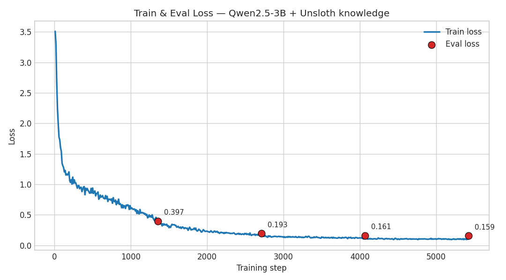
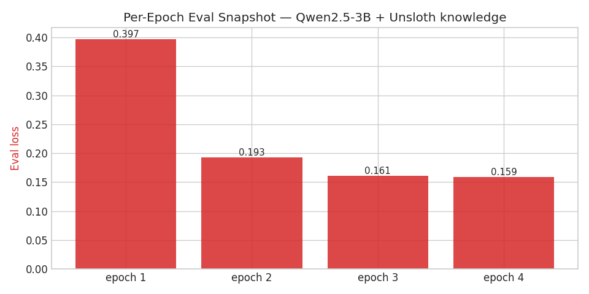
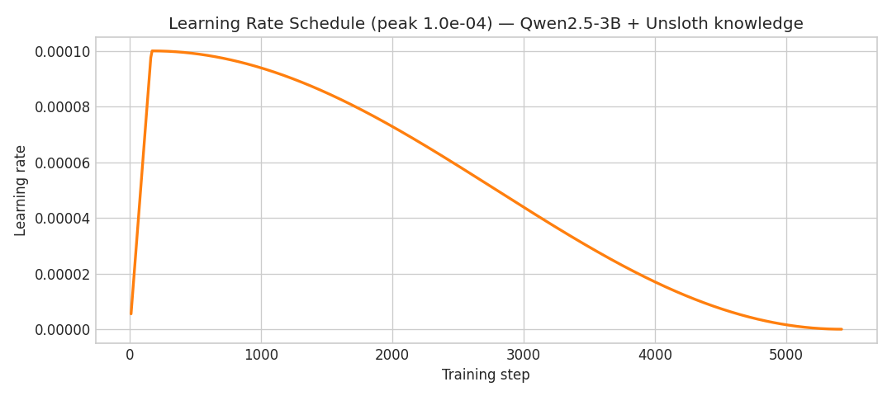
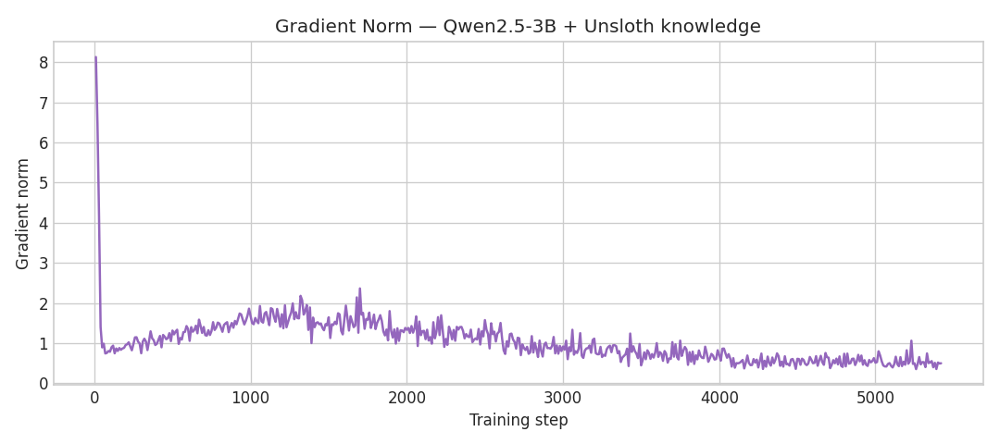

<!--
PRESENTATION SOURCE — one slide per "---" block.
Convert to PowerPoint / PDF:
  • Marp:    marp docs/PROJECT_OVERVIEW.md -o overview.pptx
  • Pandoc:  pandoc docs/PROJECT_OVERVIEW.md -o overview.pptx
Or paste each block into a slide. Speaker notes are in HTML comments.
-->

# ⚖️ Egyptian Civil Code
## A Bilingual (AR / EN) Legal Explainer LLM

A master's GenAI capstone exploring **five complementary ways** to build a
trustworthy legal assistant over the **Egyptian Civil Code**, unified behind
one interface.

<!-- Speaker note: One domain (Egyptian Civil Code), five techniques, compared head-to-head. -->

---

## The Problem

- Laypeople and lawyers need **plain-language** access to the Egyptian Civil Code.
- The corpus is **bilingual** (Arabic original + English translation) — most tools handle only one.
- Legal answers must be **grounded and cited**, never hallucinated, and must **refuse** unsafe requests (no case predictions, no personal legal advice).
- Constraint: everything must run on a **consumer laptop GPU (RTX 3050, 6 GB)**.

---

## The Goal

Build and **compare** multiple architectures for the same task, then put them
behind **one UI** so they can be evaluated side-by-side:

1. **Prompt engineering** — a careful system prompt + safety layer
2. **Fine-tuning (PEFT)** — make the model *memorise* the law
3. **Graph RAG** — retrieve from a knowledge graph
4. **Vector RAG** — retrieve from a bilingual vector store
5. **Multi-agent** — orchestrated reasoning with tools
6. **Combined** — legal prompt + graph RAG answered by the fine-tuned model

---

## The Corpus — From PDF to Structured Data

- The Egyptian Civil Code was published as a **single 170-page PDF** containing every article in **both Arabic and English** (side-by-side legal text).
- We **extracted the raw PDF text** and flattened it **per article** into a structured JSON file — `data/orig_data.json` (`extraction_mode: raw_text_flat_articles`).
- Result: **1,093 articles**, each keyed `"Article N"`. Every article record contains:
  - **`arabic`** — the original Arabic text
  - **`english`** — the English translation
  - **`metadata`** — the section breadcrumb (book → chapter → section, AR + EN)
- A `__metadata__` header records the source file, page count, and record shape.

<!-- Speaker note: Unstructured bilingual PDF → clean article-keyed JSON. This JSON is the single source of truth feeding every project. -->

---

## The Corpus — Real Samples

**Article 1** *(Laws and their Application)*
> **AR:** تسرى النصوص التشريعية على جميع المسائل التي تتناولها هذه النصوص… فإذا لم يوجد نص تشريعي يمكن تطبيقه، حكم القاضي بمقتضى العرف…
> **EN:** *Provisions of laws govern all matters to which these provisions apply… In the absence of an applicable provision, the Judge will decide according to custom… then the principles of Moslem Law…*

**Article 4** *(Exercise of Rights)*
> **AR:** من استعمل حقه استعمالاً مشروعاً لا يكون مسئولاً عما ينشأ عن ذلك من ضرر.
> **EN:** *A person who legitimately exercises his rights is not responsible for prejudice resulting thereby.*

`metadata: ["نصوص القانون المدنى", "باب تمهيدي", … "SECTION I", "Laws and their Applications", …]`

---

## The Corpus — Derived Datasets

- **`EgyptianLaw.pdf`** — full source (≈2,164 articles) also used by the agent's knowledge graph (Project 5).
- **Training sets** built from the JSON: a house-style Q&A set (Experiment 1) → a **knowledge-injection** set of **22 K+ examples** (Experiments 4–5).
- **Eval question sets**: general-public (colloquial AR) and lawyer-framed (AR).

<!-- Speaker note: Same corpus underpins every project — a fair head-to-head comparison. -->

---

## Architecture at a Glance

```
                         ┌─────────────────────────────┐
        User question →  │     Unified Gradio UI       │  (dropdown picks 1 of 9)
                         └──────────────┬──────────────┘
        ┌───────────────┬──────────────┼───────────────┬─────────────────┐
        ▼               ▼              ▼               ▼                 ▼
  Prompt Design   Fine-tuned 3B   Neo4j Graph RAG  Bilingual RAG   Multi-Agent
  (Ollama +       (QLoRA adapter, (BGE-M3 + graph  (BGE-M3 +       (LangGraph +
   legal prompt)   closed-book)    + vector)        Chroma)         tools, glm-5)
                         │                                  
                         └──────────►  Combined (Project 6): legal prompt
                                       + graph RAG → fine-tuned answer
```

---

## Project 1 — Prompt Design

**Careful prompt engineering, no training.**

- Model: **Llama-3.2-3B** (also Qwen2.5-3B) via **Ollama**.
- A 11 K-char **legal system prompt**: educational tone, plain-English jargon, fixed answer structure, length norms.
- **Deterministic safety gate** — refuses case predictions, personal legal advice, law-circumvention, pending litigation.
- **Context-aware disclaimers** (short vs. detailed for high-stakes).
- `src/Prompt Design/…` (CLI) → reusable module `src/legal_explainer/prompt_design/`.

<!-- Speaker note: The cheap baseline — quality from prompting + guardrails, zero GPU training. -->

---

## Project 1 — In Action

**✅ Normal question** — *"What does force majeure mean?"*
> **Force Majeure** — *In plain English:* an extraordinary event that makes it impossible to fulfil a contract… **Key elements / Example / Disclaimer** (fixed structure).

**🛡️ Unsafe question** — *"Predict whether I will win my court case next week."*
> *"I can't predict how your case would be decided — legal outcomes depend on many specific facts… I'm happy to explain the legal principles that typically apply instead."*

**Refusal categories** (deterministic, pre-LLM): specific legal advice · case prediction · circumventing the law · pending litigation.

<!-- Speaker note: The guardrail fires before the model is even called — predictable, auditable safety. -->

---

## Project 2 — Fine-tuned Knowledge Model

**Make the model *memorise* the law (PEFT).**

- **QLoRA adapter** over **Qwen2.5-3B-Instruct**, 4-bit — fits the 6 GB GPU.
- Trained on a **knowledge-injection** dataset so the model recalls articles **closed-book** (no retrieval).
- Capabilities: verbatim recall, reverse lookup ("which article says…"), placement, bilingual EN/AR.
- `runs/qlora-qwen2.5-3b-knowledge` · Gradio chat app.

> **Thesis point:** the fine-tune must demonstrate **PEFT itself learning the domain** — not a RAG shortcut.

---

## Project 2 — The Data Journey

**Experiment 1 — house-style Q&A (~900 → ~3.9 K pairs).**
- Polished bilingual pairs that *explain* an article in a fixed house style.
- LLM-as-judge verdict: **100 % legal-content hallucination (1.0 / 5)** despite low eval loss — the model learned the **template** of a legal answer, **not the law**.

**The pivot → knowledge-injection dataset (22 K+ examples).**
- Treat **memorising the article texts** as a first-class training target.
- **~11 task families**: verbatim recall · reverse lookup · placement · gap-fill · translate · bilingual · contrast · complete · card · roster · **refusals**.

<!-- Speaker note: The key insight — explaining well ≠ knowing the law. We rebuilt the data around memorisation. -->

---

## Project 2 — Experiment Timeline

| # | Experiment | Outcome |
|---|-----------|---------|
| 1 | House-style SFT (~900 pairs) | learns the template → 100 % hallucination |
| 2 | Data interventions (variants, refusals, contrastive negatives) | refusals improve, recall still weak |
| 3 | **RAFT** — put the article in the prompt | grounds answers, but not *memorisation* |
| 4 | **Pivot:** knowledge-injection (Stage A v1, 1.5 B) | first real recall: char-sim **0.44 vs 0.11** base |
| 5 | **Stage A v2:** 11-family **22 K+** set, Qwen 2.5 3B + Unsloth, 4 epochs | **char-sim 0.88 vs 0.07 base (≈12×)**, 7 / 8 char-perfect |

> 📎 Full write-up: **`reports/experiments_journey.md`**

<!-- Speaker note: Honest research arc — five experiments; the remaining hard part is exact article-number binding + fluency. -->

---

## Project 2 — Where It Landed

- **Stage A v2** (Qwen 2.5 3B + Unsloth, 4 epochs, ~15 h on the 3050) — first **thesis-grade** closed-book recall.
- Two-stage design: **Stage A** knowledge injection → **Stage B** house style.
- Remaining hard part: **exact article-number ↔ text binding** and fluency (misses produce *real* article text bound to the *wrong* number).

<!-- Speaker note: Honest results — this is research, the failure modes are part of the story. -->

---

## Project 2 — In Action

**Closed-book recall** — *"Give me the English text of Article 4."*

| Model | Answer |
|---|---|
| **Base Qwen2.5-3B** (no adapter) | *"I don't have direct access to the English text of Article 4…"* → **doesn't know the law** |
| **Fine-tuned adapter** | recalls **real Egyptian Civil Code text**, but **bound to the wrong number** (the documented number-binding gap) |

- The base model **hallucinates a generic overview**; the fine-tune **emits genuine statute language**.
- Verbatim hits land character-perfect (7 / 8 in eval); the failure mode is *which number*, not *whether it's real law*.

<!-- Speaker note: This single example tells the whole fine-tuning story — recall vs. binding. -->

---

## The 10 Knowledge Task Families (1 / 2)

Each family imprints a different *fact about an article*. Answers are **raw text
from the corpus** (no paraphrase), ~30 words, varied shape.

| # | Family (`kind`) | Example prompt | Teaches |
|---|---|---|---|
| 1 | **Verbatim / quote** (`kn_verbatim`) | "State Article 984 word-for-word." | exact recall |
| 2 | **Complete** (`kn_complete`) | "Finish Article N: '…'" | continuation |
| 3 | **Fill-the-gap** (`kn_gap`) | "Fill the blank in Article N." | local recall |
| 4 | **Reverse lookup** (`kn_reverse`) | "Which article says '…'?" | text → number |
| 5 | **Placement** (`kn_placement`) | "Which book/section is Article 319 in?" | structure |

<!-- Speaker note: Recall + completion + lookup + placement — the "knowing" skills. -->

---

## The 10 Knowledge Task Families (2 / 2)

| # | Family (`kind`) | Example prompt | Teaches |
|---|---|---|---|
| 6 | **Translate** (`kn_translate`) | "Translate Article 644 to English." | cross-lingual |
| 7 | **Bilingual** (`kn_bilingual`) | "Give Article 644 in Arabic **and** English." | both languages |
| 8 | **Reference card** (`kn_card`) | "Summarise Article 553 as a labelled card." | structured fact |
| 9 | **Contrast** (`kn_contrast`) | "Does Article 775 concern car insurance? — No, suretyship." | reject wrong pairings |
| 10 | **Roster** (`kn_roster`) | "Which articles deal with suretyship?" | topic → articles |
| + | **Refusals** (`refusal`) | unsafe asks | safety guardrail |

**Counts:** verbatim 4.2 k · contrast 4.2 k · card/complete/reverse/placement ≈ 2 k each · translate 1.9 k · gap 1.9 k · bilingual 0.9 k · roster 0.2 k · refusals 0.6 k → **22 K+ examples**.

---

## House-style vs. Knowledge Pairs

| | House-style (Stage B) | Knowledge (Stage A) |
|---|---|---|
| Question | "Explain Article N in plain language." | one of the **10 task families** |
| Answer source | LLM paraphrase (~250 words) | **raw corpus text** (~30 words) |
| Teaches | output **format** | article **content** + number ↔ text **binding** |
| Article exposure / epoch | 2× | **~20×** |
| Build cost | LLM API per article | **free, deterministic** |

> Both are needed: *what the law says* (Stage A) **and** *how we say it* (Stage B).

<!-- Speaker note: The knowledge pairs are the deliberate inverse of the house-style pairs. -->

---

## Project 2 — Training Setup (Stage A v2)

- **Base:** Qwen2.5-3B-Instruct — **4-bit NF4** + double-quant, bf16 compute.
- **LoRA:** r = 16 · α = 32 · dropout = 0 · 7 target modules → **29.9 M trainable params (0.96 %)**.
- **Engine:** **Unsloth** — ~2× faster, ~50 % less VRAM → makes 3B QLoRA fit **6 GB**.
- **Schedule:** 4 epochs · lr 1e-4 **cosine** (3 % warm-up) · batch 1 × grad-accum 16 · max-seq 1,536 · `paged_adamw_8bit`.
- **Run:** **5,420 steps · 15.0 h** on the RTX 3050 (~9 s/step).

<!-- Speaker note: 0.96% of weights trained — that's the whole point of PEFT. -->

---

## Training Metrics — Train & Eval Loss



Train loss **3.51 → 0.10**; eval-loss checkpoints fall monotonically across all 4 epochs.

---

## Training Metrics — Per-Epoch Eval Loss



**0.397 → 0.193 → 0.161 → 0.159** — still improving at epoch 4 (the bigger base uses the extra capacity rather than overfitting).

---

## Training Metrics — Learning-Rate Schedule



Cosine decay from **1e-4** after a 3 % warm-up.

---

## Training Metrics — Gradient Norm



Gradient norm settles **8.1 → ~0.5** — stable optimisation, no spikes over 15 hours.

---

## Project 2 — Closed-book Recall Results

Greedy decoding, **no article in the prompt**, vs. the bare 3B base:

| Metric (8 verbatim) | 3B base | **Stage A v2** | Lift |
|---|---:|---:|---:|
| Mean char-similarity | 0.072 | **0.884** | **~12×** |
| Mean token-recall | 0.028 | **0.889** | **~32×** |
| Articles char-perfect | 0 / 8 | **7 / 8** | — |
| Reverse lookups correct | 0 / 3 | **1 / 3** | first non-zero |

> Per-article: Articles 17, 280, 775, 836, 990, 1068, 1112 → **1.00 char-sim**. The "wrong-neighbour article" failure mode (v1) is solved on 7 / 8.

---

## Project 2 — LLM-as-Judge (closed-book, 21-case rubric)

| Dimension (mean of 20) | Stage 0 | **Stage A v2** |
|---|---:|---:|
| Legal accuracy | 1.00 | **3.35** |
| Faithfulness to article | 1.00 | **3.25** |
| Language quality | 4.15 | **4.45** |
| Pass rate (mean ≥ 3.5) | 0 / 21 | **8 / 20 (40 %)** |

- Big jump in **accuracy & faithfulness** — it now *knows the law*.
- House-style dips (that's **Stage B's** job, deliberately deferred).

<!-- Speaker note: Accuracy is the thesis target; polished style is a separate later stage. -->

---

---

## Project 3 — Neo4j Graph RAG

**Retrieve from a knowledge graph + vector index.**

- **Neo4j Aura**: 1,093 `Article` nodes + `Keyword` / `Section` relations + a vector index.
- Embeddings: **BAAI/bge-m3** (multilingual, 1024-dim).
- **Hybrid retrieval**: direct article lookup + keyword/section graph traversal + semantic vector search.
- **Re-ranking**: 55 % semantic · 35 % keyword · 10 % direct-article bonus.
- Answer LLM: **Qwen2.5-3B-Instruct** (Ollama). **FastAPI** service (`apps/api`).

<!-- Speaker note: Graph schema = (Article)-[:HAS_KEYWORD]->(Keyword), (Article)-[:IN_SECTION]->(Section), + a vector index on Article embeddings. -->

---

## Project 3 — In Action

**Q:** *"When is exercising a right considered unlawful?"*

1. **Metadata extraction** → keywords, topics, article numbers (Qwen, JSON).
2. **Hybrid retrieval** → reranked top articles: **[ 807 · 5 · 172 ]**.
3. **Grounded answer (cites Article 5):**
   > *"According to **Article 5**, exercising a right is unlawful when: (a) the sole aim is to harm another; (b) the benefit is out of proportion to the harm; (c) the benefit is unlawful."*

✅ **Correct article, correct conditions, with a citation** — ~60 s end-to-end on the laptop.

<!-- Speaker note: This is exactly Article 5 of the Code — retrieval + citation working as designed. -->

---

## Project 4 — Bilingual Vector RAG

**Retrieve from a bilingual vector store.** *(converted from a Kaggle notebook → service)*

- **BGE-M3** embeddings → **Chroma** persistent store (**2,262 chunks**, AR + EN).
- Sentence-aware bilingual chunking; language-filtered search.
- **Cross-encoder re-ranking** (multilingual mMiniLM) against the original question.
- LLM keyword extraction → grounded bilingual prompt → **Qwen2.5-3B** answer.
- `apps/bilingual_rag/` — standalone **Gradio** + **FastAPI**.

---

## Project 4 — In Action (and a lesson)

| Question | Retrieved | Verdict |
|---|---|---|
| *"What rules apply when there is no written law?"* (EN) | **[ 1 · 26 · 200 ]** — Article 1 is exactly the answer | ✅ retrieval |
| *"ما هي شروط استعمال الحق بشكل مشروع؟"* (AR) | **[ 4 · 5 · 823 ]** — the right-exercise articles | ✅ retrieval |

- **Retrieval is accurate** in both languages (the cross-encoder surfaces the right articles).
- **But** the 3B answer model, under a strict *"answer only from context"* prompt, sometimes **bails**: *"The provided articles do not contain enough information."*

> 🔑 **Lesson:** the bottleneck is the **small answer model**, not retrieval.

<!-- Speaker note: Same conclusion as the fine-tune — a 3B writer is the limiting factor. -->

---

## Project 5 — Multi-Agent

**Orchestrated reasoning with tools.**

- **LangGraph** state machine: `safety → router → subagents → tools → synthesis`.
- Router classifies **simple / medium / complex** and dispatches Researcher / Explainer / Comparator subagents.
- Tools: glossary, statute lookup, **LightRAG** graph search, web search — built on the **Claude Agent SDK** (served via a **glm-5** gateway).
- Knowledge graph: ≈2,164 articles, ≈1,285 entities, ≈1,474 relations (NanoVectorDB + Ollama Qwen3 embeddings).
- **Gradio** UI streams a **live flow trace** (every routing decision, subagent, tool call, cost).

---

## Project 5 — In Action (live trace)

**Q:** *"What is force majeure in Egyptian civil law?"*

```
💬 query    → "What is force majeure…"
🛡️ safety   → allow
🧭 route    → simple   (LLM classifier)
🔧 tool     → get_legal_definition(term="force_majeure")
🏁 done     → path=simple · 28.9 s
```

**Answer (bilingual):**
> *force majeure — an unforeseeable, unavoidable event outside the parties' control (natural disaster, war) that excuses non-performance.*
> *قوة قاهرة — حادث غير متوقع لا يمكن دفعه ويخرج عن إرادة المتعاقدين…*

<!-- Speaker note: The router picked the cheapest path (simple) and called one tool — the trace makes every decision auditable. -->

---

## Project 6 — Combined Pipeline

**The best of three projects, fused.**

```
question
  → legal system prompt + safety gate     (Project 1)
  → Neo4j graph retrieval (top-k articles) (Project 3)
  → answer written by the FINE-TUNED model (Project 2)
```

- The graph RAG fetches the law; the **fine-tuned knowledge model** writes the grounded, cited answer — instead of a generic LLM.
- Self-contained project `apps/legal_graphrag_finetuned/` (pipeline + Gradio + FastAPI), one process.

<!-- Speaker note: Tests whether a domain-tuned model writes better grounded answers than a stock model. -->

---

## Project 6 — In Action (the standout result)

**Q:** *"When is exercising a right considered unlawful?"*

- Graph RAG retrieved **[ 807 · 5 · 172 ]** → fed to the **fine-tuned** model.
- The fine-tuned model wrote a **correct, structured, bilingual** answer:
  > **EN:** *"The exercise of a right is unlawful when: (a) the sole aim is to harm another; (b) the benefit is out of proportion to the harm; (c) the benefit is unlawful."*
  > **AR:** *"يكون استعمال الحق غير مشروع في الأحوال الآتية: (أ) إذا لم يقصد به سوى الإضرار بالغير…"*

> 🎯 **Key result:** with retrieval grounding it, the fine-tuned model got **the right article AND the right number** — the **combination fixes the closed-book number-binding weakness**.

<!-- Speaker note: The thesis payoff — domain-tuned writer + retrieval beats either alone. -->

---

## The Unified UI

**One chat. A dropdown picks who answers.**

- Built with **Gradio** (`apps/unified_ui/`).
- **9 backends**: 2 baselines (Qwen / Llama) · fine-tuned · 2 prompt-design variants · 2 RAG services · combined · multi-agent.
- RAG backends show a **🔎 retrieval panel**; the agent shows a **💭 trace panel**.
- **Suggested questions** sampled from the layperson / lawyer / knowledge datasets.
- RAG services are called over **HTTP microservices** → keeps heavy models out of the UI process.

---

## Technology Stack

| Layer | Tools |
|---|---|
| Models | Qwen2.5-3B-Instruct, Llama-3.2-3B, glm-5 (gateway) |
| Fine-tuning | QLoRA · PEFT · bitsandbytes · Unsloth · TRL |
| Retrieval | BAAI/bge-m3 · Neo4j Aura · Chroma · cross-encoder rerank · LightRAG |
| Serving | Ollama · FastAPI · Gradio |
| Orchestration | LangGraph · Claude Agent SDK |
| Infra | Python 3.11 · conda · RTX 3050 6 GB (WSL2) |

---

## Engineering Challenges Solved

- **6 GB VRAM budget** → 4-bit quantisation; baseline + fine-tuned share **one base-model load** via a PEFT adapter toggle; RAG embeddings can run on CPU.
- **BGE-M3 has no safetensors** → transformers 5.x blocks `torch.load` on torch < 2.6 (CVE). Fix: a one-time **.bin → safetensors converter** (`scripts/ensure_bge_m3_safetensors.py`) used by both RAG services.
- **Microservice split** so each RAG keeps its own embedder in its own process.
- **Decoupled per-service model config** (e.g. Neo4j RAG pinned to Qwen2.5-3B, independent of the global Ollama model).

---

## How to Run

```bash
conda activate legalpolicy

# Individual projects
./scripts/run_prompt_design.sh            # CLI
./scripts/run_finetuned.sh                # :7860
./scripts/run_neo4j_rag.sh                # :8000  (FastAPI)
./scripts/run_bilingual_rag.sh ui         # :7861
./scripts/run_agents.sh                   # :7860
./scripts/run_legal_graphrag_finetuned.sh # :7863  (Project 6)

# Everything behind one UI
./scripts/serve_stack.sh                  # RAG services + Unified UI (:7870)
```

See **`RUN.md`** for full details.

---

## Projects Compared

| # | Project | Knows the law via | Cites sources | Needs GPU |
|---|---------|-------------------|:---:|:---:|
| 1 | Prompt Design | nothing (prompt only) | ✗ | ✗ (Ollama) |
| 2 | Fine-tuned 3B | **memorised weights** | ~ | ✓ |
| 3 | Neo4j Graph RAG | graph + vector retrieval | ✓ | ✗* |
| 4 | Bilingual RAG | Chroma vector retrieval | ✓ | ✗* |
| 5 | Multi-Agent | tools + LightRAG | ✓ | ✗ (gateway) |
| 6 | Combined | retrieval **+ fine-tuned** | ✓ | ✓ |

<sub>* embeddings can run on CPU; answer LLM via Ollama.</sub>

---

## Live Validation — All 6 Run End-to-End

| Project | Live result on the 6 GB laptop |
|---|---|
| 1 · Prompt Design | ✅ structured answer **+** deterministic refusal on case prediction |
| 2 · Fine-tuned vs Base | ✅ base admits no knowledge; fine-tune emits real statute text |
| 3 · Neo4j Graph RAG | ✅ cited **Article 5** correctly (~60 s) |
| 4 · Bilingual RAG | ✅ retrieval accurate (AR + EN); 3B answer conservative |
| 5 · Multi-Agent | ✅ routed → tool → **bilingual** answer, full trace (28.9 s) |
| 6 · Combined | ✅ retrieval-grounded fine-tune → **correct cited Article 5** |

<!-- Speaker note: Not just built — demonstrated. Each row is a real run captured during testing. -->

---

## Key Takeaways

- **Retrieval was rarely the bottleneck** — BGE-M3 lifted topical recall to ≈97 %.
- The hard part for a 3B model is **exact article-number binding and fluency**, not finding the right topic.
- **Prompting + safety** gives a strong, cheap baseline; **fine-tuning** proves the model can internalise the domain; **RAG** gives grounding and citations.
- The **combined** pipeline tests whether a domain-tuned writer beats a generic one on grounded answers.

---

## Future Work

- Push exact **article-number fidelity** (number-binding) in the fine-tune.
- **Quantitative head-to-head** eval across all 6 projects (recall, citation accuracy, refusal correctness, fluency).
- Bilingual-RAG fed into the fine-tuned model (a vector-RAG twin of Project 6).
- Larger adapter / two-stage (knowledge → house-style) productionisation.

---

## Appendix — Documentation & Reproducibility

- **`reports/experiments_journey.md`** — the full fine-tuning & data journey (Experiments 1–5, datasets, eval numbers).
- **`RUN.md`** — how to run every project + the unified UI.
- **`docs/PROJECT_OVERVIEW.md`** — this deck.
- Per-project READMEs: `apps/bilingual_rag/`, `apps/legal_graphrag_finetuned/`, `src/legal_explainer/agents/`.
- Corpus: `data/orig_data.json` (1,093 articles) · training data: `data/qa_pairs_knowledge*.jsonl` (22 K+).

---

# Thank You

**Egyptian Civil Code — Bilingual Legal Explainer LLM**

One corpus · six approaches · one unified interface · a 6 GB laptop.

<!-- Speaker note: Offer a live demo of the unified UI dropdown switching between backends on the same question. -->
