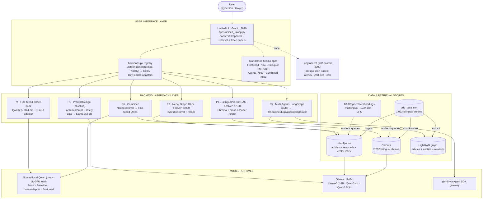
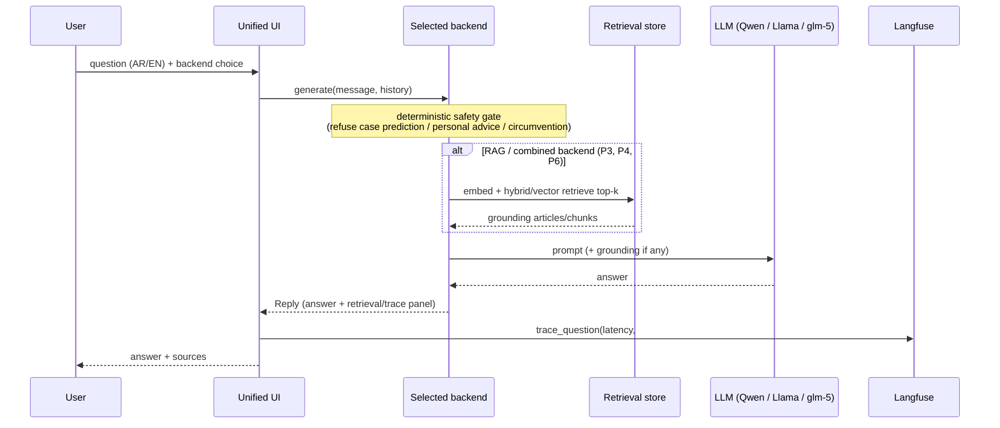
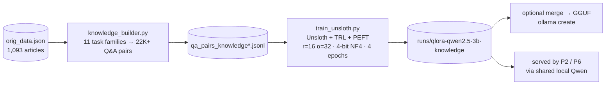

# LegalPolicy_LLM — High-Level System Architecture

Bilingual (EN/AR) legal explainer over the **Egyptian Civil Code** (1,093 articles).
The system fronts **six comparable approaches** — prompt engineering, fine-tuning, two RAG
styles, multi-agent, and a combined pipeline — behind one unified UI, all running on a
single consumer laptop GPU (RTX 3050, 6 GB).

> Two formats are provided:
> - [`architecture.drawio`](architecture.drawio) — open at <https://app.diagrams.net> (File → Open).
> - The Mermaid diagrams below — render on GitHub or any Mermaid viewer.

---

## 1. System overview (component graph)

---

## 2. Request flow (per query)

---

## 3. Offline training pipeline (produces the P2 adapter)

---

## 4. Component reference

| # | Component | Entry point | Port | Stack | Retrieval / model |
|---|-----------|-------------|------|-------|-------------------|
| 0 | Unified UI | `apps/unified_ui/app.py` | 7870 | Gradio | routes to all backends |
| 1 | Prompt Design | `src/.../prompt_design/assistant.py` | CLI | Ollama | Llama-3.2-3B + safety gate |
| 2 | Fine-tuned (closed-book) | `app/finetuned_3b_knowledge_chat_app.py` | 7860 | Gradio + local Qwen | Qwen2.5-3B 4-bit + QLoRA |
| 3 | Neo4j Graph RAG | `apps/api/main.py` | 8000 | FastAPI | BGE-M3 → Neo4j Aura → Qwen2.5:3b |
| 4 | Bilingual Vector RAG | `apps/bilingual_rag/api.py` / `gradio_app.py` | 8100 / 7861 | FastAPI + Gradio | BGE-M3 → Chroma → Qwen2.5:3b |
| 5 | Multi-Agent | `src/.../agents/gradio_app.py` | 7860 | LangGraph | LightRAG + tools → glm-5 |
| 6 | Combined | `apps/legal_graphrag_finetuned/app.py` | 7863 | Gradio | Neo4j retrieval → fine-tuned Qwen |
| — | Observability | `deploy/langfuse/docker-compose.yml` | 3000 | Langfuse v3 | Postgres · ClickHouse · Redis · MinIO |
| — | Full stack | `scripts/serve_stack.sh` | 7870 | all services | — |

### Cross-cutting concerns
- **Safety gate** (deterministic refusal rules) fires *before* the LLM in P1, P5, P6.
- **One corpus** (`data/orig_data.json`) feeds every backend and the training pipeline.
- **Shared embedder** (BGE-M3, CPU) backs both RAG stores, freeing GPU for the LLM.
- **VRAM strategy** (6 GB): one 4-bit Qwen load shared between baseline and fine-tuned via PEFT toggle; RAG services run as separate processes alongside Ollama.
- **Evaluation**: `general_user_legal_questions.csv`, `lawyer_llm_solution_questions.csv`, `scenarios_full.jsonl`, golden `article_lookup_golden.csv`.
