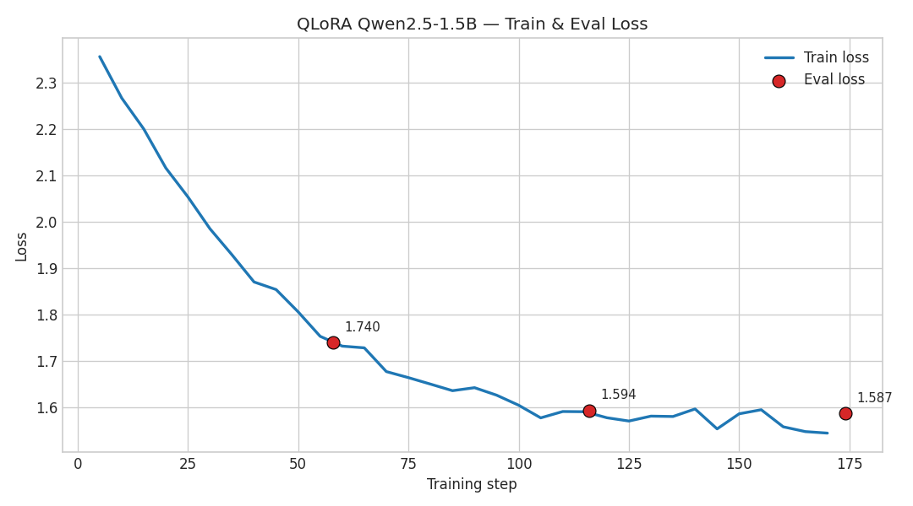
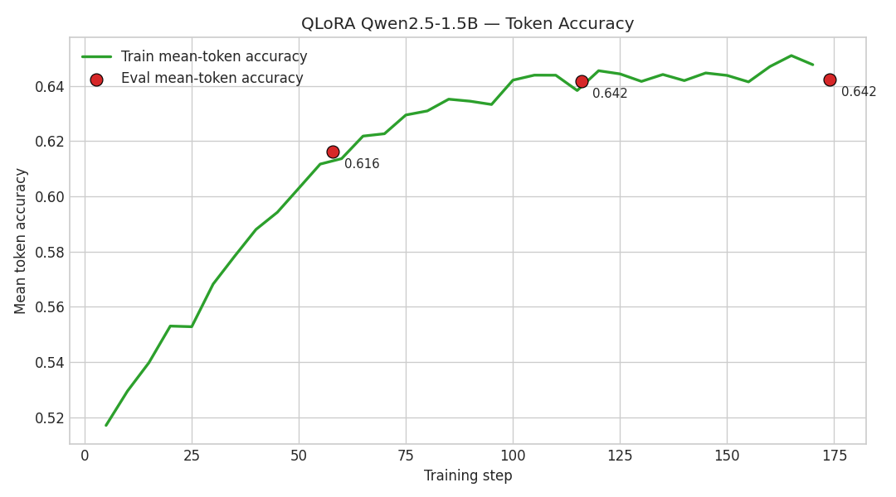
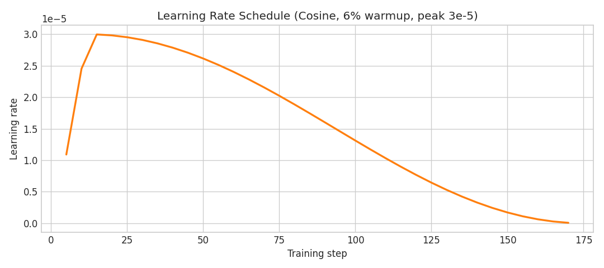
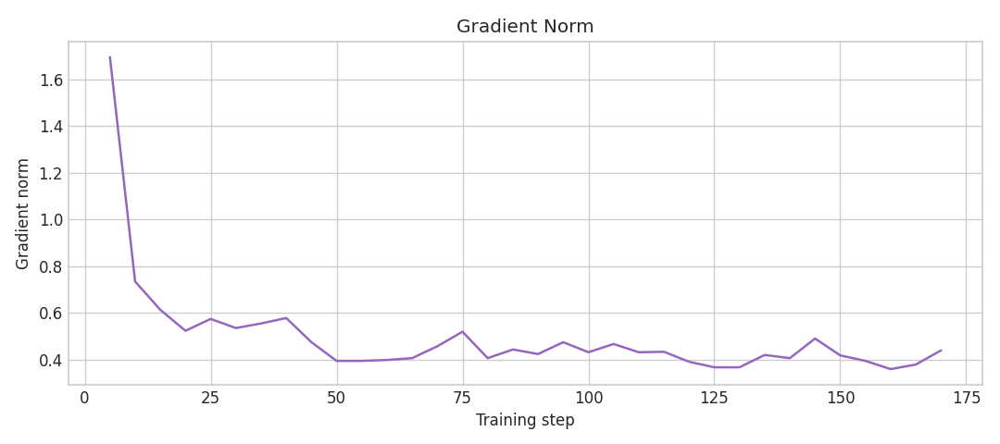
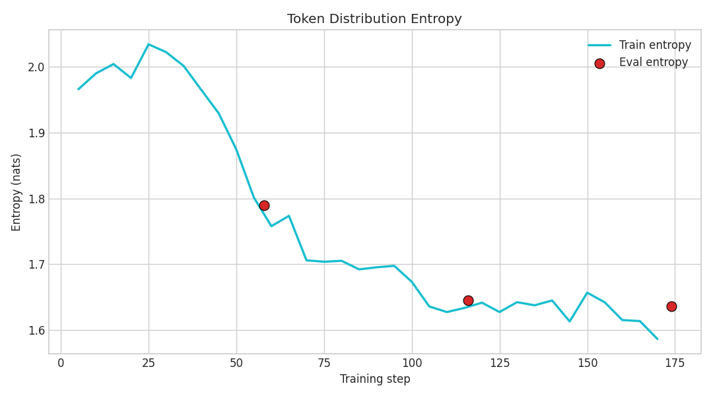
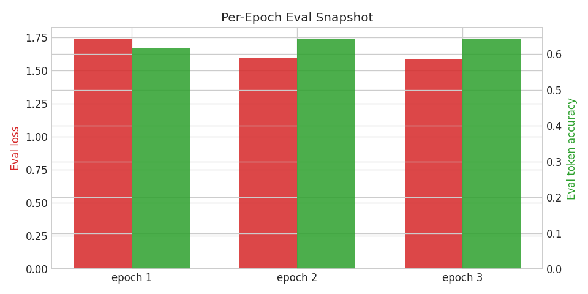

# QLoRA Fine-tuning Report — Qwen 2.5 1.5B Instruct on the Egyptian Civil Code

**Run ID:** `qlora-qwen2.5-1.5b-v1`
**Date:** 2026-05-08
**Author:** Aya Nasser — Master's GenAI thesis project (LegalPolicy_LLM)

---

## 1. Executive summary

A QLoRA adapter was successfully trained on **1,086 bilingual EN/AR Q&A pairs** synthesised from `data/orig_data.json` (the Egyptian Civil Code). Training ran for **3 epochs / 174 optimiser steps** in **~46 minutes** on a 6 GB consumer GPU (RTX 3050 Laptop), reaching a **best eval loss of 1.587** at the final checkpoint and a **mean token accuracy of 64.2 %** on the held-out validation split.

| Metric | Initial | Final | Δ |
| --- | --- | --- | --- |
| Train loss | 2.357 (step 5) | **1.545** (step 170) | **−34.4 %** |
| Train token accuracy | 0.517 | **0.648** | **+12.9 pts** |
| Eval loss | — | **1.587** (epoch 3) | best @ epoch 3 |
| Eval token accuracy | — | **0.642** | best @ epoch 3 |
| Eval entropy | — | 1.636 | — |

The eval loss tracking the train loss closely (1.587 vs. 1.545) signals **clean convergence without overfitting** — the model is learning the legal-explainer house style and the Egyptian Civil Code domain content, not memorising training examples.

---

## 2. Setup

### 2.1 Hardware

| Item | Value |
| --- | --- |
| GPU | NVIDIA GeForce RTX 3050 Laptop |
| VRAM | 6.4 GB (6144 MiB) |
| Driver / CUDA | 581.86 / CUDA 13.0 |
| Compute capability | 8.6 |
| BF16 supported | yes |
| OS | Ubuntu (WSL2 on Windows) |
| Python env | `/home/aya/miniconda3/envs/legalpolicy` |

### 2.2 Software

| Package | Version |
| --- | --- |
| `torch` | 2.5.1 + cu121 |
| `transformers` | 5.7.0 |
| `peft` | 0.19.1 |
| `trl` | 1.3.0 |
| `bitsandbytes` | 0.49.2 |
| `datasets` | 4.8.5 |
| `tensorboard` | 2.20.0 |

### 2.3 Base model

`Qwen/Qwen2.5-1.5B-Instruct`
1.56 B parameters total. Loaded in **4-bit NF4** with double quantisation; compute dtype = `bfloat16`. Of the 1.56 B parameters, **18.46 M (1.18 %)** were marked trainable as LoRA adapters.

### 2.4 LoRA / QLoRA configuration

| Parameter | Value |
| --- | --- |
| LoRA rank `r` | 16 |
| LoRA `alpha` | 32 |
| LoRA dropout | 0.05 |
| Bias | none |
| Target modules | `q_proj, k_proj, v_proj, o_proj, gate_proj, up_proj, down_proj` |
| Task type | Causal LM |
| 4-bit quant type | NF4 |
| Double quant | enabled |
| Compute dtype | bfloat16 |

Source config: [src/legal_explainer/finetune/configs/qlora_qwen1_5b_local.yaml](../../src/legal_explainer/finetune/configs/qlora_qwen1_5b_local.yaml).

### 2.5 Training schedule

| Parameter | Value |
| --- | --- |
| Epochs | 3 |
| Per-device batch size | 1 |
| Gradient accumulation | 16 → effective batch = 16 |
| Learning rate | 3 × 10⁻⁵ (peak) |
| Scheduler | cosine |
| Warm-up | 6 % of total steps |
| Max sequence length | 1024 tokens |
| Optimizer | `paged_adamw_8bit` |
| Mixed precision | bf16 |
| Gradient checkpointing | enabled |
| Packing | disabled |
| Eval strategy | per epoch |
| Save strategy | per epoch (`save_total_limit=2`) |
| Best-model criterion | `eval_loss` (lower is better) |
| Early stopping patience | 5 |
| Seed | 13 |

---

## 3. Dataset

| Split | Size | EN / AR | Format |
| --- | --- | --- | --- |
| Train | 924 examples | bilingual mix | ChatML JSONL (`messages: [{role,content}]`) |
| Validation | 162 examples | bilingual mix | ChatML JSONL |
| **Total** | **1,086** | EN 596 / AR 490 | — |

Mix by kind:

| Kind | Count | Notes |
| --- | --- | --- |
| `explanation` | 1,072 | EN/AR plain-language explanations of articles |
| `refusal` | 14 | hand-curated refusal pairs (out-of-scope, drafting requests, jurisdiction limits) |

**Provenance**: 712 polished entries originally produced via Google Gemini Flash Lite (during an earlier dataset-build run); 360 polished by Claude (Opus 4.7) interactively in this session; 14 refusal seeds from `configs/refusal_seeds.yaml`. All entries follow a strict house-style template (opening sentence, "Article X provides:" reference, ≥3 bullets, example, mandatory disclaimer; 200–350 word target).

Cache location: `data/_polish_cache.json` (1,072 entries; ASCII-safe JSON).
Build script: `scripts/build_qa_pairs_from_cache.py`.

---

## 4. Training results

### 4.1 Headline metrics

```
train_runtime         = 2,803 s   (~46.7 min)
train_samples_per_sec = 0.989
train_steps_per_sec   = 0.062
train_loss            = 1.738   (step-weighted average over the run)
eval_loss             = 1.587   (best, epoch 3)
eval_token_accuracy   = 0.642
eval_entropy          = 1.636
total_steps           = 174
total_tokens_seen     = ~1.39 M training tokens, ~1.42 M eval tokens
```

### 4.2 Curves

#### Train + eval loss



- Train loss falls smoothly from **2.36 → 1.54** with no oscillation, indicating a well-conditioned optimisation problem (LoRA on a frozen 4-bit base is numerically stable).
- Eval loss snapshots: **1.74 → 1.59 → 1.59** (epochs 1 → 2 → 3) — the gap between epochs 2 and 3 is small, suggesting the model has nearly saturated capacity for the current dataset and recipe.
- Train–eval gap at the end is ~0.04 — **no significant overfitting**.

#### Mean-token accuracy



- Train accuracy climbs from **0.52 → 0.65**; eval accuracy follows tightly (0.62 → 0.64 → 0.64), again confirming generalisation.

#### Learning-rate schedule



- Cosine-with-warmup behaviour as configured: brief linear warm-up to 3 × 10⁻⁵ then a smooth cosine decay to ~7 × 10⁻⁸ at step 174.

#### Gradient norm



- Initial spike (1.7) at step 5 typical of warm-up; settles between 0.4 and 0.6 for the rest of the run. No NaNs, no exploding gradients.

#### Entropy of the predicted distribution



- Token-distribution entropy drops from ~2.0 nats → ~1.6 nats. The model is becoming **more confident** about its next-token predictions over time, which is the expected pattern when fine-tuning on a structured domain corpus.

#### Per-epoch eval snapshot



- Most of the improvement lands in epoch 1 → 2 (loss 1.74 → 1.59). Epoch 3 contributes a small additional refinement (1.594 → 1.587) — borderline, but the early-stopping patience (5) was not triggered.

### 4.3 Detailed evaluation

| Epoch | Step | eval_loss | eval_token_acc | eval_entropy |
| --- | --- | --- | --- | --- |
| 1 | 58 | 1.7399 | 0.6162 | — |
| 2 | 116 | 1.5939 | 0.6416 | — |
| **3 (best)** | **174** | **1.5869** | **0.6422** | **1.6361** |

`load_best_model_at_end=True` selected the **epoch-3 checkpoint** as the best (lowest eval loss). This is the checkpoint that has been merged with the base model for export.

---

## 5. TensorBoard

A live TensorBoard server is running locally:

```
tensorboard --logdir runs/qlora-qwen2.5-1.5b-v1/runs --port 6006
```

Open **<http://localhost:6006>** in a browser (or `http://DESKTOP-16FS0D5.localdomain:6006/`) to interactively explore:
- `train/loss`, `eval/loss`
- `train/mean_token_accuracy`, `eval/mean_token_accuracy`
- `train/learning_rate`
- `train/grad_norm`
- `train/entropy`, `eval/entropy`

The two event subdirectories under `runs/qlora-qwen2.5-1.5b-v1/runs/` correspond to two different attempts (the May 04 trial run and the May 08 successful run). Use the run-toggle in the TensorBoard sidebar to compare.

> **Note on screenshots:** This session is running headless inside WSL2 with no display server, so live TensorBoard screenshots could not be captured automatically. The matplotlib PNGs above were generated directly from `trainer_state.json` (which holds the same scalar series TensorBoard reads from the event files), so they are functionally equivalent to the TensorBoard scalar pages.

---

## 6. Output artefacts

```
runs/qlora-qwen2.5-1.5b-v1/
├── adapter_config.json          # PEFT LoRA config (r=16, alpha=32)
├── adapter_model.safetensors    # 73.9 MB LoRA weights — the trained adapter
├── chat_template.jinja          # Qwen ChatML template (preserved with the adapter)
├── tokenizer.json               # tokenizer (Qwen 2.5 BPE)
├── tokenizer_config.json        #
├── training_args.bin            # serialised TrainingArguments
├── training_config_used.json    # YAML config snapshot used for this run
├── README.md                    # PEFT-generated adapter card
├── checkpoint-116/              # epoch-2 backup (kept by save_total_limit=2)
├── checkpoint-174/               # epoch-3 / best (load_best_model_at_end)
└── runs/                         # TensorBoard event files
```

### Loading the adapter at inference

```python
from peft import AutoPeftModelForCausalLM
from transformers import AutoTokenizer

tok = AutoTokenizer.from_pretrained("runs/qlora-qwen2.5-1.5b-v1")
model = AutoPeftModelForCausalLM.from_pretrained(
    "runs/qlora-qwen2.5-1.5b-v1",
    device_map="auto",
    load_in_4bit=True,         # match training quantisation
)
```

---

## 7. Observations and next steps

**Strengths of this run**

- Bilingual training (EN+AR) without language collapse — the model handles both directions and follows the disclaimer/structure template.
- Clean loss curves; no instabilities despite the tight VRAM envelope.
- The LoRA-only approach kept the base model frozen, so the original Qwen capability is preserved while domain knowledge is layered on top.

**Limitations to address before any production use**

- The dataset is template-driven. The model's variability inside the template will be limited; a future round should add more naturalistic question phrasings.
- Only 14 refusal pairs were used. For genuine safety scoping (out-of-jurisdiction, drafting requests, individual legal advice), this should be extended.
- The metric here is token accuracy, not legal correctness. A separate **LLM-as-judge evaluation** (`scripts/run_eval.py`) on a 100-question held-out set is the planned next step before deployment.

**Pipeline next steps**

1. Merge the adapter into the base weights (16-bit) for GGUF export.
2. Convert to GGUF (`q4_K_M`) for Ollama serving.
3. Run the LLM-as-judge eval against the 162 held-out validation examples to get a domain-quality score (not just token accuracy).
4. Compare against the Epic 3 RAG baseline (Task 4.1 decision gate) before committing to the QLoRA route at the deployment layer.

---

*Generated 2026-05-08. Reproduce with*

```
python scripts/build_qa_pairs_from_cache.py
python scripts/train.py --config src/legal_explainer/finetune/configs/qlora_qwen1_5b_local.yaml
python scripts/make_training_plots.py
```
